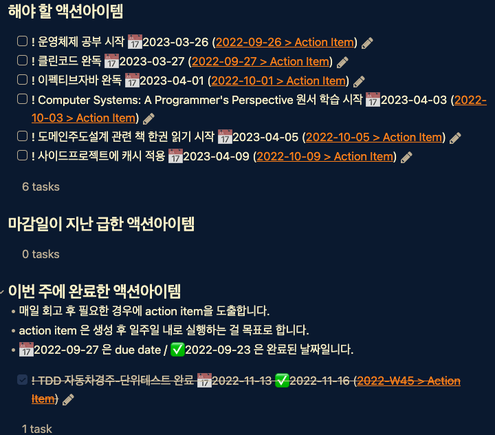

## 2022년 11월 3주차
### 이번 주 한 일
- TDD 자동차경주 4단계 완료
- TDD 자동차경주 5단계 완료
- 코드 정적 분석을 위한 소나 클라우드 적용 후 코드 개선
- TDD 로또 1단계 진행 중
- 책-자바의신 처음부터 빠르게 읽는 중
- 나의 핵심 가치와 목적의식 그리고 구체적인 목표 설정을 했다. 

### 이번 주 Action Item 점검

### 못한 일
- 주말 오후에 특별한 일이 없었고, 우선순위가 있는 계획이 있었음에도 진행하지 못했다.

### 잘한 일
- 최종 목표, 5년 목표, 1년 목표, 한 달 목표, 한 주 목표, 하루 목표를 세웠다. 그리고 그 목표들을 이뤄나가는데 더 많은 실행을 하기 위해 공개적인 곳에 회고 기록하는 걸 시작했다. 도움이 된다고 느낀다. 더불어 다른 사람의 회고를 읽고 새로운 생각을 하게 해준다는 점이 재미가 있다.  
- 핵심 가치 3가지를 적었는데 그 가치 중에 하나가 건강이었다. 작은 실행으로 가능한 한 매일 산책을 하기로 했고 이번 주에는 매일 했다. 점점 강도를 올려서 달리는 것도 해보려고 한다. 
- DDD 에 관심이 생겨 최범균님의 '도메인 주도 개발 시작하기' 책 스터디 모임을 시작했다.장

### 회고
- 계획에 있어서 데드라인 설정의 힘이 정말 크다고 느낀다. 데드라인이 설정된 사이드프로젝트와 TDD 프로젝트의 진행이 잘 되고 있다.
- 주말 오후의 시간을 잘 활용하지 못하는 이유가 '쉼'의 시간이 정해져 있지 않아서이지 않을까? 생각하고 있다. 쉬는 것도 중요한데 제대로 쉬지 못하고 있는 것 같다. 그 주의 스케줄에 따라 토요일 오후 혹은 일요일 오후 블록 하나는 '쉼' 의 시간으로 정하고, 혼자만의 시간을 충분히 가져보려고 한다.

### Action Item
- [ ] ! 주말 오후 블록 하나는 해야할 일에 좀 더 집중하기 위해 카페에서 할 일을 진행한다. 📅 2022-11-27