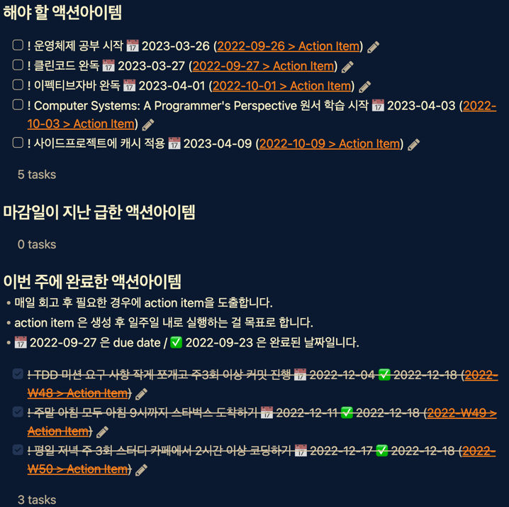
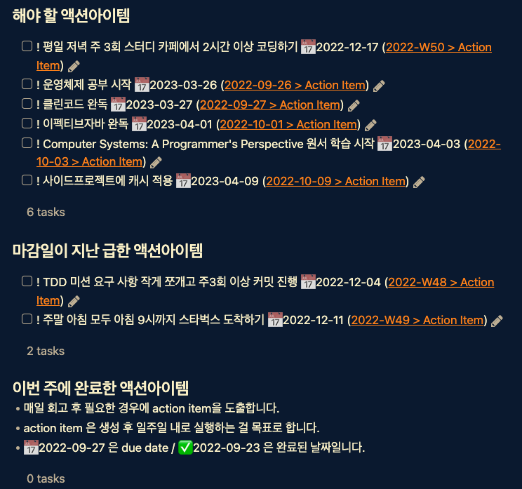

## 2022년 12월 3주차
### 이번 주 한 일
- 성공과 실패를 결정하는 1% 네트워크 원리 story 2개 읽고 문서 정리
- 도메인 주도 개발 시작하기 챕터4 읽고 문서 정리
- 사이드 프로젝트 댓글 관련 리포지토리 테스트 코드를 작성했다.
- 알고리즘 문제를 매일 1문제 씩 풀었다.
- 종필 멘토님 홈커밍데이에 참여해서 개발자로서 3년 간의 회고 발표를 했다.

### Action Item 점검

### 못한 일 -> 원인 파악 후 개선
- TDD 미션 커밋을 하기는 했는데 코드 리뷰 요청까지는 하지 못했다. 현재 내 수준보다 지나치게 어렵다고 느끼고 있다.

### 잘한 일 -> 강화시키기
- 개발자로서 불특정다수가 있는 곳에서 처음으로 발표를 했다. 다음에는 기회가 된다면 기술 발표를 해보고 싶다 라고 생각했다.

### 회고
- 한 일은 많은데 뭔가 충분히 만족스럽지가 않다. 그 이유는 좀 더 고민을 해봐야 겠지만 투입할 수 있는 시간과 현재 위치, 실력 대비 내 욕심 때문에 너무 많은 일들을 진행하고 있어서 그런 것 같다. 빨리 마무리 할 수 있는 일들은 좀 더 그 일에 우선 집중해서 빨리 처리를 해야겠다.

---

## 2022년 12월 2주차
### 이번 주 한 일
- 도메인 주도 개발 시작하기 챕터2 읽고 문서 정리, DDD 책모임 참가
- 성공과 실패를 결정하는 1% 네트워크 원리 story2~3 읽고 문서 정리
- 사이드 프로젝트 리포지토리 테스트 일부 추가 후 커밋함
- 멘토님과 지난 9월부터 진행하던 작은 프로젝트를 완료 범위까지 마무리 했다.
- 알고리즘 문제를 매일 1문제 씩 풀었다.

### Action Item 점검

### 못한 일 -> 원인 파악 후 개선
- 주말 아침 모두 9시까지 스타벅스에 도착하겠다는 액션 플랜을 세웠는데 토요일 아침에 일어났다가 다시 잠 들어서 9시 30분에 도착했다. 평일에 항상 9시에 맞춰서 일어나다보니 이게 습관이 된 것 같다. 8시에 알람을 맞추긴 했는데 꺼버렸다. 8시에 일어나면 좀 여유롭긴 한데 급하지 않은 시간이어서 알림을 끄고 자기가 더 쉬운 것 같다. 8시 20분에 알람을 맞추고 다음주에 다시 도전....💪  지금 상황에 맞는 기상 시간을 잘 찾아보자.
- 아침 고정 시간 확보하는 건 완전히 실패했다. 액션 아이템을 수정해서 저녁 고정 시간을 확보하려고 한다. 그리고 목표를 좀 더 구체화해서 평일 저녁 주3회 스터디카페에 가서 2시간 이상(1회 이용권 최소 시간)은 시간을 보내려고 한다. 집에서 가장 가까운 스터디카페 100시간 권의 유효기간이 180일인데 그걸 끊어서 180일 내에 적어도 100시간을 평일 저녁에 보낼 계획이다. 스터디카페 가는 김에 산책도 하고 여러모로 좋을 것 같다.

### 잘한 일 -> 강화시키기
- 책 스터디를 빠지지 않고 참여했다. 지금 읽고 있는 책 외에 추가로 늘리지는 않아야겠다.

### 회고
- 아침 시간을 잘 활용하지 못해서 아쉽다. 나를 더 파악할 수 있는 한 주였다.
- 개발자 관련 온라인 세션이나 모임을 참여하면 뭐든 조금이라도 도움이 되겠지 하는 마음으로 그동안 가볍게 시작했던 게 꽤 많았던 것 같다. 그런데 앞으로는 이 시간이 지금 정말 나에게 중요한가? 와 처음부터 끝까지 정해진 기간을 참여할 수 있을까? 를 고려해서 고민하고 참여를 해야겠다. 이런 비정기적인 일정 때문에 규칙적으로 내가 지금 정말 하고 싶은 일을 할 시간 확보하기가 좀 어렵다고 느끼고 있다.  구글 캘린더를 좀 비워야겠다. 특히 연말이라 평소보다 이벤트가 많은데 이벤트가 없는 날은 평일 저녁에 2시간이 아니라 3시간 목표로 가능한 한 더 많이 시간 투자를 해야겠다.
- 매일 뭔가를 하겠다는 욕심보다는 우선 주3회로 계획을 해야겠다고 느꼈다. 매일 목표로 세우는 경우에, 한번 실패하면 의지가 정말 많이 꺾인다. 그래서 마감일이 지난 기존 액션아이템을 실천 가능하게 변경했다.
  - TDD 미션 요구 사항 작게 쪼개고 하루에 하나 이상 씩 완료하고 커밋하기(7 커밋 이상) -> TDD 미션 요구 사항 작게 쪼개고 주3회 이상 커밋 진행
### Action Item
- [ ] ! 평일 저녁 주 3회 스터디 카페에서 2시간 이상 코딩하기 📅 2022-12-17

---

## 2022년 12월 1주차
### 이번 주 한 일
- Autowired 를 사용한 필드주입과 생성자 주입의 차이 문서 정리
- 사전 질문 준비해서 DDD 책 모임 참가
    - 챕터2까지 완료
- 성공과 실패를 결정하는 1%의 네트워크 원리 책으로 네트워크 공부 시작
    - story1까지 완료

### Action Item 점검

### 못한 일 -> 원인 파악 후 개선
- 계획했던 TDD 미션 매일 1커밋 씩 하는 건 하지 못해서 아쉽다. 다음주에 아침 8시~아침 9시 고정 시간을 확보해서 진행해보려고 한다.
- 주말 아침에 9시까지 스타벅스에 나가는 습관을 만들고 있는데 이번 주 토요일에는 실패했다. 새벽 늦게 까지 하는 축구와 눈이 와서 너무 춥겠다 라는 핑계를 만들어서.... ㅎㅎ 다음 주 주말은 변수가 생기더라도 다 참가할 수 있도록 액션아이템에 추가해야겠다. 액션아이템에 추가하고 공유하면 더 잘 지키게 되는 장점이 있다!

### 잘한 일 -> 강화시키기
- 다음 주를 더 잘 보내기 위한 주간 목표를 만들고 공개적인 공간에 공유했다.

### 회고
- 이번 주는 시간이 정말 빠르게 지나갔다. 일정이 바빠서 계획을 세우지 못하고 생각나는대로만 진행을 하다보니 뭘 했는지 명확하게 잘 모르겠다. 아무리 바빠도 하루의 시작 혹은 하루의 끝은 계획과 회고로 하는게 좋겠다. 그게 나한테 맞는 것 같다고 느낀다.

### Action Item
- [ ] ! 주말 아침 모두 아침 9시까지 스타벅스 도착하기 📅 2022-12-11
- [ ] ! 평일 아침 8시 ~ 9시 고정 시간 확보해서 코딩하고 커밋하기 📅 2022-12-11

--- 

## 2022년 11월 4주차
### 이번 주 한 일
- 도메인 주도 개발 시작하기 책 모임 시작
- TDD 로또 1단계 진행
- TDD 자동차 경주 처음부터 다시 구현해봄
- 사이드프로젝트에 리포지토리 테스트코드 일부 작성

### Action Item 점검

### 못한 일 -> 원인 파악 후 개선
- 매일 계획을 세우고 회고를 하려고 계획했으나 제대로 실천하지는 못했다.
- 도메인 주도 개발 시작하기 책 모임을 적극적으로는 참여하지 못해서 아쉽다.

### 잘한 일 -> 강화시키기
- 매일 독서를 5쪽 이상 했고 산책도 했다.
- 빠른 피드백의 중요성을 크게 실감하고 코드 리뷰 요청을 3번이나 했다.
- 네트워크 공부를 좀 제대로 해보려고 계획을 세웠다.
- 계획대로 주말 오후에 카페 가서 할 일을 했다. 집 근처 괜찮은 카페를 발견해서 좋았다. 다음 주 오후에도 별 일 없으면 가야겠다. 그리고 액션 아이템에 추가하는 건 정말 효과적이다.

### 회고
- 독서 5쪽과 산책처럼 공부 계획도 욕심을 버리고 작게 세울 필요가 있음을 느꼈다. 매일 계획을 세우지 못한 이유 중에 하나가 그 전 날 하지 못한 계획을 다음 날 이어서 진행하다보니 당일의 계획을 세우지 않은 문제가 있었다.
- 일주일에 한 번씩 진행하는 독서 모임은 정말 좋은 것 같다. 이런 책 모임을 지속적으로 참가해야겠다. DDD 모임이 내년 2월 쯤 끝나면 클린코드나 이펙티브 자바 스터디 모임을 참여할 계획이다.

### Action Item
- [ ] ! 주말 오후 블록 하나는 해야할 일에 좀 더 집중하기 위해 카페에서 할 일을 진행하고 커밋까지 진행한다.  📅 2022-12-04
- [ ] ! DDD 책 모임에 적극적으로 참여하기 위해 같이 이야기하고 싶은 것 3가지 준비하기 📅 2022-12-04
- [ ] ! TDD 미션 요구 사항 작게 쪼개고 하루에 하나 이상 씩 완료하고 커밋하기(7 커밋 이상) 📅 2022-12-04

--- 

## 2022년 11월 3주차
### 이번 주 한 일
- TDD 자동차경주 4단계 완료
- TDD 자동차경주 5단계 완료
- 코드 정적 분석을 위한 소나 클라우드 적용 후 코드 개선
- TDD 로또 1단계 진행 중
- 책-자바의신 처음부터 빠르게 읽는 중
- 나의 핵심 가치와 목적의식 그리고 구체적인 목표 설정을 했다. 

### 이번 주 Action Item 점검

### 못한 일
- 주말 오후에 특별한 일이 없었고, 우선순위가 있는 계획이 있었음에도 진행하지 못했다.

### 잘한 일
- 최종 목표, 5년 목표, 1년 목표, 한 달 목표, 한 주 목표, 하루 목표를 세웠다. 그리고 그 목표들을 이뤄나가는데 더 많은 실행을 하기 위해 공개적인 곳에 회고 기록하는 걸 시작했다. 도움이 된다고 느낀다. 더불어 다른 사람의 회고를 읽고 새로운 생각을 하게 해준다는 점이 재미가 있다.  
- 핵심 가치 3가지를 적었는데 그 가치 중에 하나가 건강이었다. 작은 실행으로 가능한 한 매일 산책을 하기로 했고 이번 주에는 매일 했다. 점점 강도를 올려서 달리는 것도 해보려고 한다. 
- DDD 에 관심이 생겨 최범균님의 '도메인 주도 개발 시작하기' 책 스터디 모임을 시작했다.

### 회고
- 계획에 있어서 데드라인 설정의 힘이 정말 크다고 느낀다. 데드라인이 설정된 사이드프로젝트와 TDD 프로젝트의 진행이 잘 되고 있다.
- 주말 오후의 시간을 잘 활용하지 못하는 이유가 '쉼'의 시간이 정해져 있지 않아서이지 않을까? 생각하고 있다. 쉬는 것도 중요한데 제대로 쉬지 못하고 있는 것 같다. 그 주의 스케줄에 따라 토요일 오후 혹은 일요일 오후 블록 하나는 '쉼' 의 시간으로 정하고, 혼자만의 시간을 충분히 가져보려고 한다.

### Action Item
- [ ] ! 주말 오후 블록 하나는 해야할 일에 좀 더 집중하기 위해 카페에서 할 일을 진행한다. 📅 2022-11-27